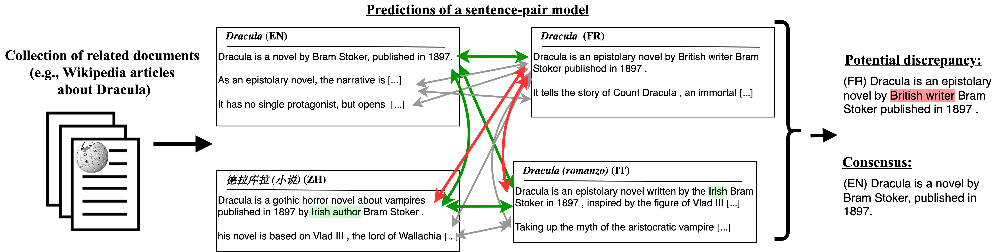

# Wikipedia Translated Clusters
This is the dataset introduced and described in the EMNLP 2022 Findings paper [Stretching Sentence-pair NLI Models to Reason over Long Documents and Clusters](https://arxiv.org/abs/2204.07447).

It is a collection of 5K introductions to popular English Wikipedia articles, with their parallel versions in 10 other languages, and machine translations to English. Also includes a synthetically corrupted dataset where one sentence out of the English Wiki is modified, and the task is to use the multilingual documents to identify the outlier with natural language inference (NLI).



## Data format

The `all_clusters` file contains intorductions to popular English Wikipedia articles, and their machine versions in 10 other languages, machine translated to English. The introductions are split into lists of sentneces. Format:
```
`Article title in English` : {
‘en’: English intro to the Wiki article, split into a list of sentences.
‘de’: German intro, translated to English and split into a list of sentences.
‘fr’: French …
'it': Italian …
'pl': Polish …
'ru': Russian … 
'pt': Portuguese …
'es': Spanish …
'zh': Chinese …
'sv': Swedish …
'uk': Ukrainian …
}
```

We include translation files per language (`popular_pages_translations_{lang}.json`) with the follwing format:
```
`Article title in English` : {
	'title': Article title in English,
 	'mtitle': Article title in source language,
'intro': Intro of the article in the source language,
'translated_intro': Translation of the article intro to English
}
```

## Synthetic corruptions dataset
We create synthetic corruptions to the English Wikipedia introductions by replacing one sentence with an alternative version (based on edits from the [VitaminC dataset](https://github.com/TalSchuster/VitaminC)). The goal in this setting is to automatically identify which sentence was modified by using the information from the other articles in the cluster (i.e., Wikipedia versions in other languages, translated to English). See the [paper](https://arxiv.org/abs/2204.07447) for more details.

The corrupted articles (`wiki_cluster_simulated_corruptions.json`) includes a dictionary with 144 titles. Each item has a list of corruption instances (total 825 instances). Each instance has the following format:
```
{
'wikis': dictionary of `language` to Wiki intro from that language translated to English and split into sentences. The English version has one sentence that was modified.
'gold_ind': [integer] A number indicating the index of the modified sentence in the English intro.
'original': [str] The sentence from the intro that was replaced
'new':  [str] The sentence that replaced the original sentence in this instance (equivalent to the sentence in wiki[‘en’][gold_ind])
'matched_sent': [str] The paired sentence to “new” in the VitaminC dataset that was matched with the “original” sentence by similarity.
}
```


## How to cite

```
@inproceedings{Schuster2022Stretching,
  title={Stretching Sentence-pair NLI Models to Reason over Long Documents and Clusters},
  author={Tal Schuster and Sihao Chen and Senaka Buthpitiya and Alex Fabrikant and Donald Metzler},
  url = {https://arxiv.org/abs/2204.07447},
  booktitle = {Findings of the Association for Computational Linguistics: {EMNLP}},
  year={2022}
}
```


## Disclaimer

This is not an official Google product.
